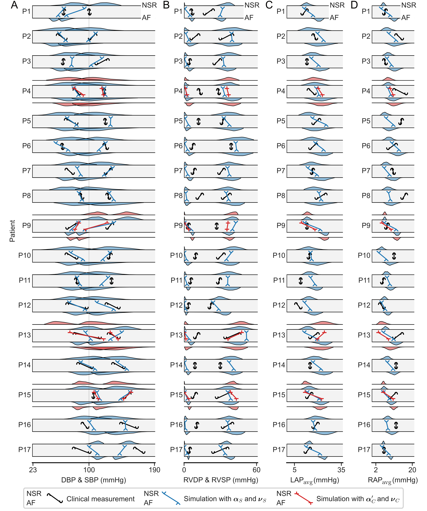
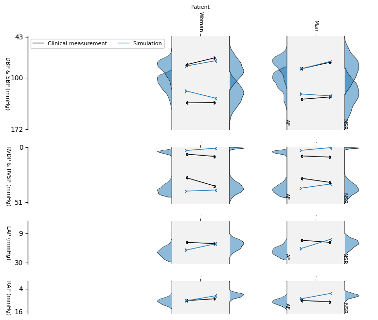
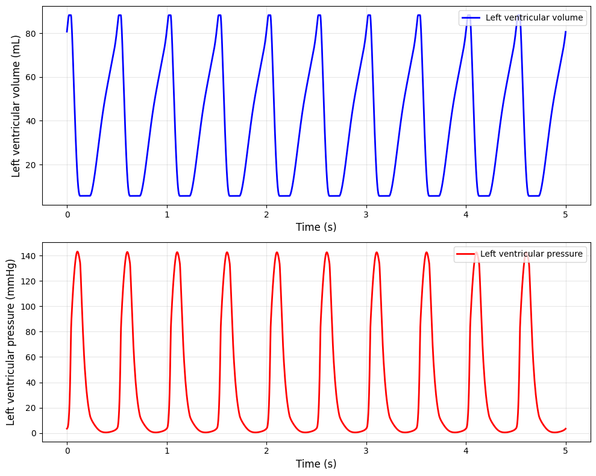
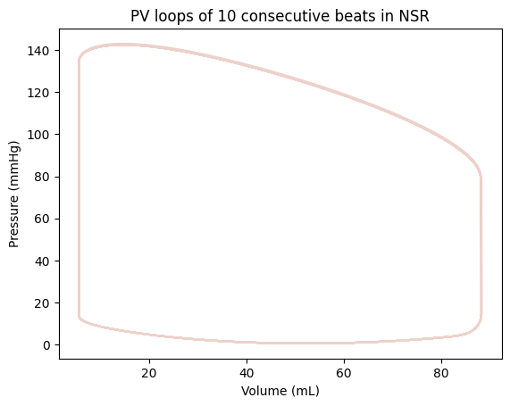
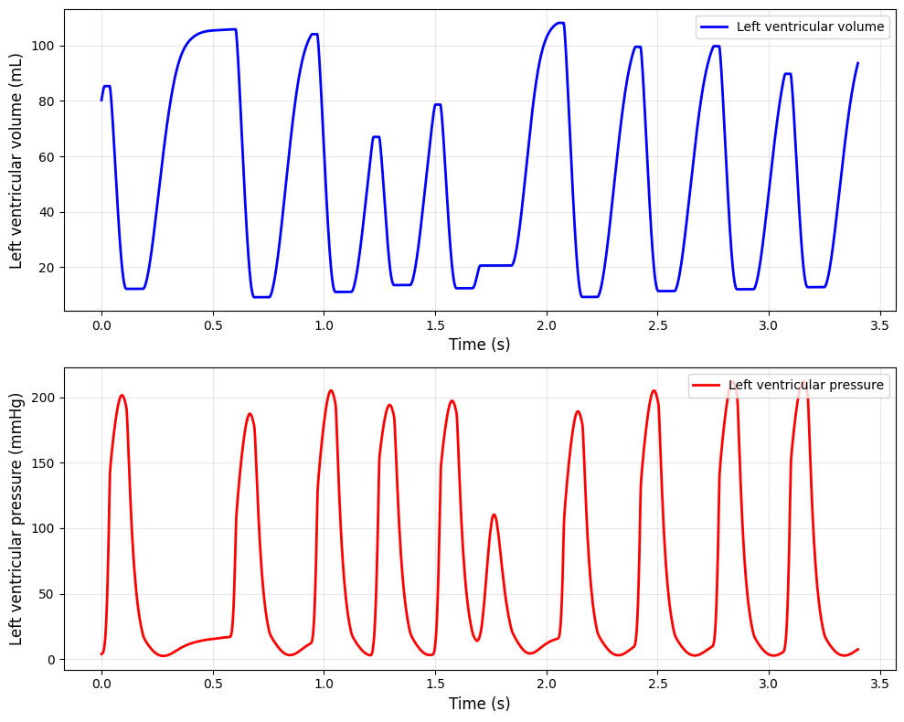
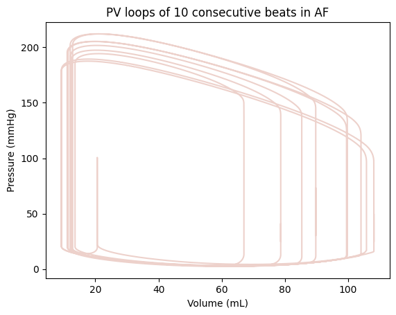

# Computational model of haemodynamics during atrial fibrillation
Welcome to this repo containing the supplementary material for our publication 'Computational model of haemodynamics during atrial fibrillation'. 

The work has been published in *The Journal of Physiology* with the doi: coming soon.

## Introduction
We developed a computational model that simulates beat-to-beat haemodynamic changes resulting from the unco-ordinated atrial and irregular electrical activation times characteristic of AF.


## Patient-specific model fitting
In our study, we produced 17 patient-specific model for AF patients in the SMURF study. We fitted the model two clinical measurements in both normal sinus rhythm and atrial fibrillation.


Results of model fitting, where each row (P1-P17) corresponds to one patient. A, diastolic and systolic blood pressure (DBP, SBP). B, right ventricular diastolic and systolic pressure (RVDP, RVSP). C, mean left atrial pressure (LAP_avg). D, mean right atrial pressure (RAP_avg). The markers show the clinical measurements (black) and simulation results with the final parameter set, fitted using alpha_S and nu_S (blue) and using alpha_C' and nu_C (red), if available, in (top) normal sinus rhythm and (bottom) atrial fibrillation. Along the top and bottom edge of a row, the posterior distribution of the Bayesian history matching is shown from which the final parameter set was selected with the cost function J.

## User example
Because the clinical data used for this study cannot be shared publicly with respect to participating subjects, we created two virtual patients representing the average male and average female from the SMURF dataset.



With the computational model, we can simulate the haemodynamics during normal sinus rhythm and atrial fibrillation.

Below, you can see a user example of haemodynamics during normal sinus rhythm for the fitted model of an average female.





Below, you can see a user example of haemodynamics during atrial fibrillation for the fitted model of an average female.





## Usage
Install the required packages available in `requirements.txt`.

See the `notebooks/demo_fitting.ipynb` file for usage details.

## Citation
If you use our work in your research, please consider citing the following paper:

**Computational model of haemodynamics during atrial fibrillation**

- *Journal:* [The Journal of Physiology](https://physoc.onlinelibrary.wiley.com/journal/14697793)
- *Authors:* Felix Plappert, Pim J.A. Oomen, Clara E. Jones, Emmanouil Charitakis, Lars O. Karlsson, Pyotr G. Platonov, Mikael Wallman, Frida Sandberg
- ```
  @article{Plappert2025,
    title={Computational model of haemodynamics during atrial fibrillation},
    author={Plappert, Felix and Oomen, Pim JA and Jones, Clara E and Charitakis, Emmanouil and Karlsson, Lars O and Platonov, Pyotr G and Wallman, Mikael and Sandberg, Frida},
    journal={The Journal of Physiology},
    volume={coming soon},
    number={coming soon},
    pages={coming soon},
    year={2025}
  }
  ```

## License

This project is licensed under the terms of the CC-BY-4.0 license.
